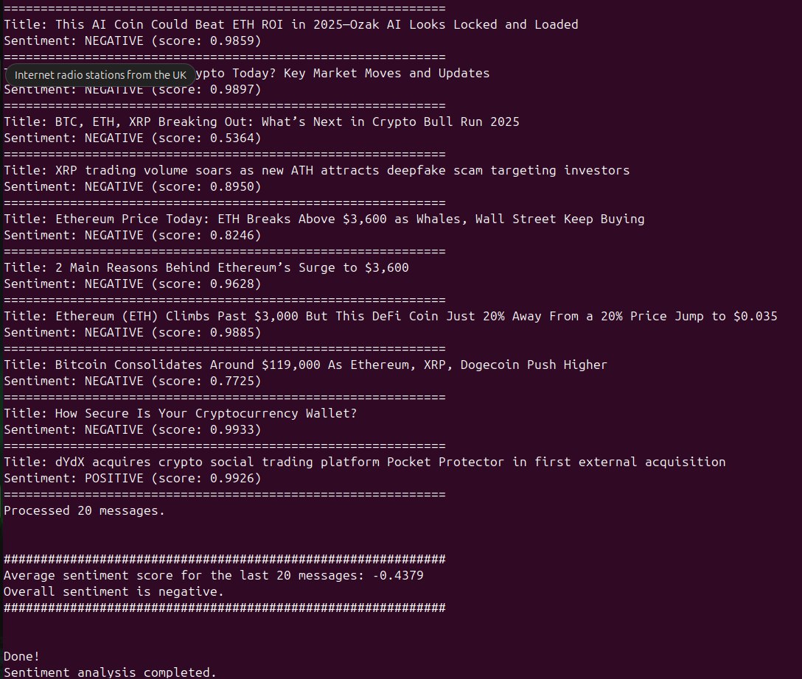

Make sure Kafka is running locally (localhost:9092) and you have a topic named news-topic.

### enabling docker

$ sudo docker start kafka-zookeeper-1

$ sudo docker start kafka-kafka-1

### using kafka cli

$ sudo docker exec -it kafka-kafka-1 bash

#### creating topic

`kafka-topics --create \
  --topic test-topic \
  --partitions 1 \
  --replication-factor 1 \
  --bootstrap-server localhost:9092`

#### produce messages

`kafka-console-producer --topic crypto-news --bootstrap-server localhost:9092
`

#### consume messages

`kafka-console-consumer --topic crypto-news --from-beginning --bootstrap-server localhost:9092`

## run code

`$ python main.py`

### output example

